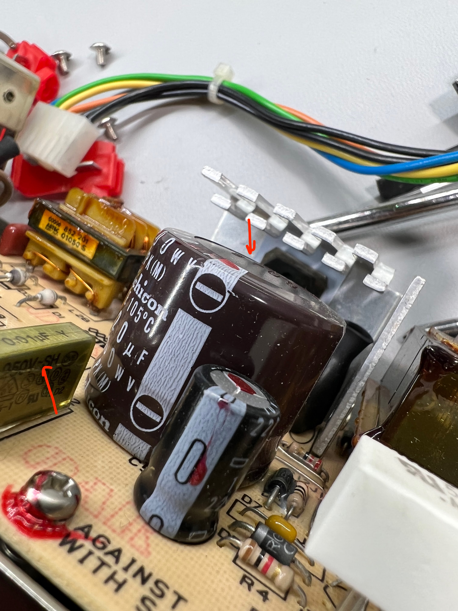
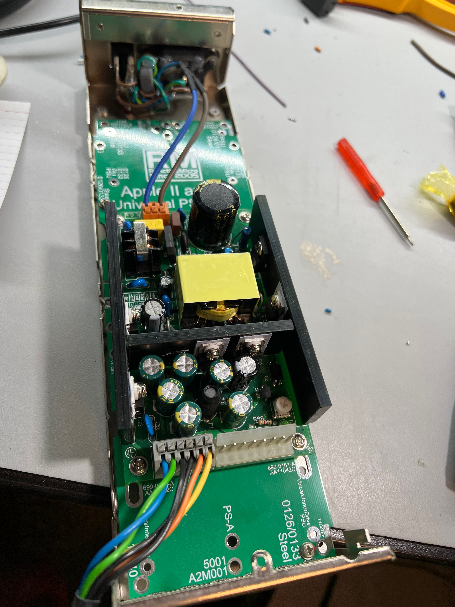
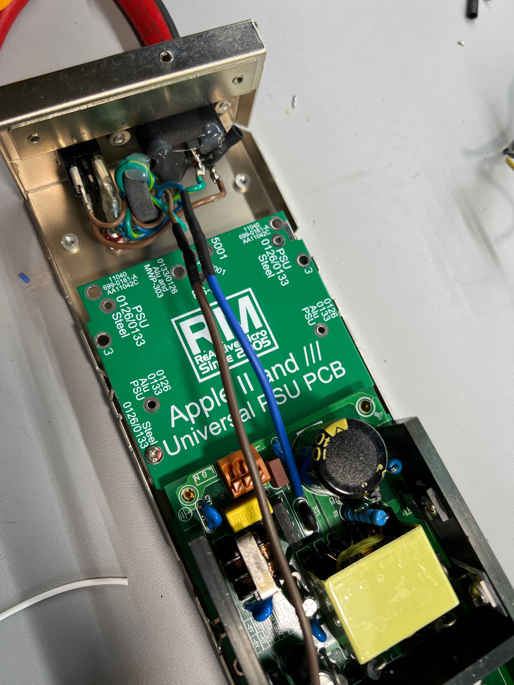

Title: ReActiveMicro IIgs Power Supply Upgrade

# Let's talk about the IIgs Power Supply Upgrade

I've been working on a project to build my childhood dream Apple IIgs and first thing is first: getting this old powersupply upgraded.  I tested it quickly but know there are RIFA caps in there so I didn't leave it on too long.  It turns out the RIFA and some other capacitors weren't looking so great so it was time to upgrade.

 

 I am going to use the [ReActiveMicro Universal PSU Kit](https://wiki.reactivemicro.com/Universal_PSU_Kit#Kit_Installation) to upgrade to a modern PSU.  I was originally just going to replace the capacitors but for the IIgs I am going to drop in some extra cards so I could use the extra power.  After pulling apart the original power supply the ReActiveMicro is an easy drop in replacement. After dropping the PSU into old case:

 

 On side note is that while this is a solderless kit I did end  up soldering the mains wires in as I didn't trust the connector it came with.
 

